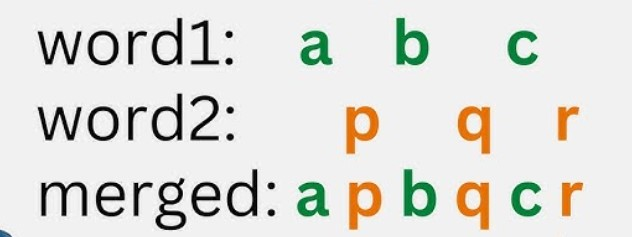
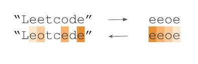

# CPP-Coding
BY Million Dollar Coder 

****************************************************************************


<h1> Leet Code Problems </h1>

# 1768. Merge Strings Alternately

# QUESTION :

You are given two strings word1 and word2. Merge the strings by adding letters in alternating order, starting with word1. If a string is longer than the other, append the additional letters onto the end of the merged string.

Return the merged string.



# ANSWER :

```
class Solution {
public:
    string mergeAlternately(string word1, string word2) {
// BY Million Dollar Coder
         int i = 0,j=0; 
         string merged="";
    while( i < word1.length() && j<word2.length()){
      merged+=word1[i++];
      merged+=word2[j++];


}
while(i < word1.length()){
    merged+=word1[i++];
}
while( j<word2.length()){
    merged+=word2[j++];
}
    return merged;
 }
};
```


*************************************************************

# 1431. Kids With the Greatest Number of Candies

# QUESTION :
There are n kids with candies. You are given an integer array candies, where each candies[i] represents the number of candies the ith kid has, and an integer extraCandies, denoting the number of extra candies that you have.

Return a boolean array result of length n, where result[i] is true if, after giving the ith kid all the extraCandies, they will have the greatest number of candies among all the kids, or false otherwise.

Note that multiple kids can have the greatest number of candies.

# ANSWER :

```
class Solution {
public:
    vector<bool> kidsWithCandies(vector<int>& candies, int extraCandies) {

        vector<bool> result;
        int size = candies.size();

        // int maxvalue = candies[0];
        // for (int j = 0; j < size; j++) {
        //     maxvalue = max(maxvalue, candies[j]);
        // }

        int maxvalue = *max_element(candies.begin(), candies.end());

        for (int i = 0; i < size; i++) {
            if (candies[i] + extraCandies < maxvalue) {
                result.push_back(false);

            } else {
                result.push_back(true);
            }
        }
        return result;
    }
};

```


*************************************************************
# 605. Can Place Flowers

# QUESTION :

You have a long flowerbed in which some of the plots are planted, and some are not. However, flowers cannot be planted in adjacent plots.

Given an integer array flowerbed containing 0's and 1's, where 0 means empty and 1 means not empty, and an integer n, return true if n new flowers can be planted in the flowerbed without violating the no-adjacent-flowers rule and false otherwise.

 

# ANSWER :

```
class Solution {
public:
    bool canPlaceFlowers(vector<int>& flowerbed, int n) {
        int count = 0;
        for (int i = 0; i < flowerbed.size(); i++) {
            if (flowerbed[i] == 0) {
                int start = (i == 0 || flowerbed[i - 1] == 0) ? 0 : 1;
                int end = (i == flowerbed.size() - 1 || flowerbed[i + 1] == 0)
                              ? 0
                              : 1;

                if (start == 0 && end == 0) {
                    count++;
                    flowerbed[i] = 1;
                }
            }
        }
        if (count >= n) {
            return true;
        }
        return false;
    }
};
```


*************************************************************

# 1071. Greatest Common Divisor of Strings

# QUESTION :

For two strings s and t, we say "t divides s" if and only if s = t + ... + t (i.e., t is concatenated with itself one or more times).

Given two strings str1 and str2, return the largest string x such that x divides both str1 and str2.

 

# ANSWER :

```
class Solution {
public:
    string gcdOfStrings(string str1, string str2) {

        if (str1 + str2 == str2 + str1) {
            int x = gcd(str1.length(), str2.length());
            return str1.substr(0, x);
        }

        return "";
    }
};
```


*************************************************************

# 345. Reverse Vowels of a String

# QUESTION :

Given a string s, reverse only all the vowels in the string and return it.

The vowels are 'a', 'e', 'i', 'o', and 'u', and they can appear in both lower and upper cases, more than once.


 

# ANSWER :

```
class Solution {
public:
    string reverseVowels(string s) {
        int i = 0;
        int j = s.length() - 1;
        while (i <= j) {
            if (s[i] == 'a' || s[i] == 'e' || s[i] == 'i' || s[i] == 'o' ||
                s[i] == 'u' || s[i] == 'A' || s[i] == 'E' || s[i] == 'I' ||
                s[i] == 'O' || s[i] == 'U') {
                if (s[j] == 'a' || s[j] == 'e' || s[j] == 'i' || s[j] == 'o' ||
                    s[j] == 'u' || s[j] == 'A' || s[j] == 'E' || s[j] == 'I' ||
                    s[j] == 'O' || s[j] == 'U') {
                    swap(s[i], s[j]);
                    i++;
                    j--;
                } else {
                    j--;
                }
            }

            else {

                if (s[j] == 'a' || s[j] == 'e' || s[j] == 'i' || s[j] == 'o' ||
                    s[j] == 'u' || s[j] == 'A' || s[j] == 'E' || s[j] == 'I' ||
                    s[j] == 'O' || s[j] == 'U') {
                    i++;
                } else {
                    i++;
                    j--;
                }
            }
        }

        return s;
    }
};

```


*************************************************************

